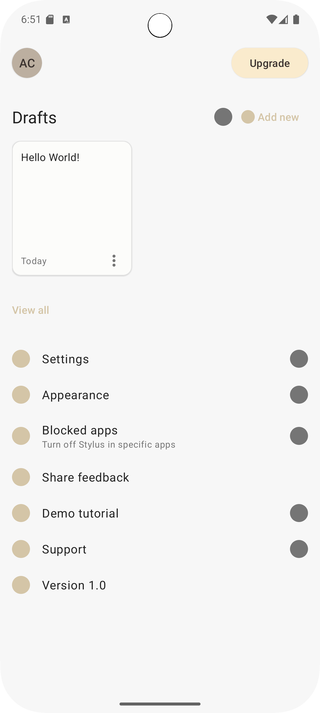
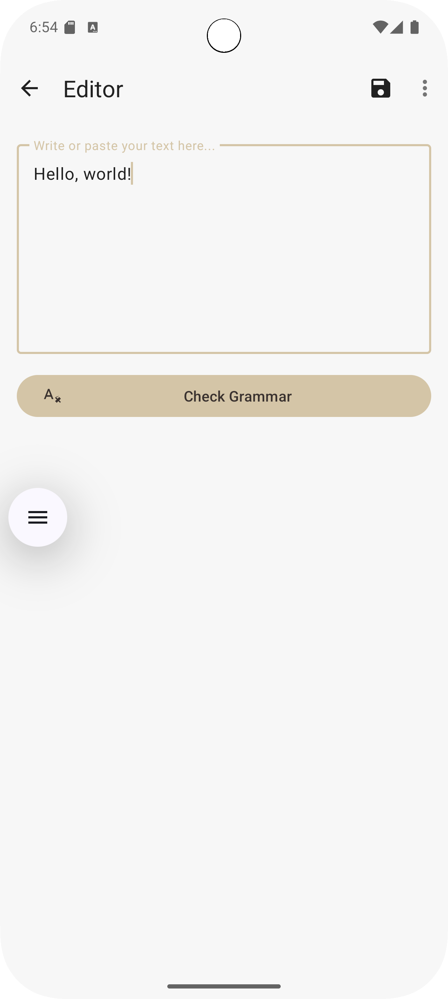

# Stylus - AI-Powered Grammar Correction App

A modern Android application that provides intelligent grammar and writing correction.

## Screenshots

|                              Home Screen                              |                                Text Editor                                 |
|:---------------------------------------------------------------------:|:--------------------------------------------------------------------------:|
|  |  |

## Key Features

- **AI-Powered Grammar Checking** with detailed error explanations
- **Draft Management** with local Room database storage
- **Material Design 3** UI with clean, intuitive interface
- **MVVM Architecture** with Dagger Hilt dependency injection

## Development Status

**Completed**
- Core MVVM architecture with proper separation of concerns
- Draft management system with Room database
- Text editor with grammar checking UI
- Material Design 3 implementation
- Retrofit API integration (ready for ML model)

**In Progress**
- Custom AI grammar correction API (ML model fine-tuning)
- Advanced correction suggestions interface

**Planned**
- Multi-language support
- Cloud synchronization
- Google Play Store release

## Contact

**Developer**: Aymane Cheraher  
**Repository**: [github.com/Cheracpp/stylus](https://github.com/Cheracpp/stylus)

---
